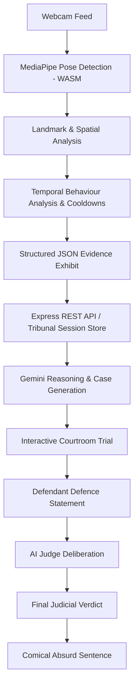
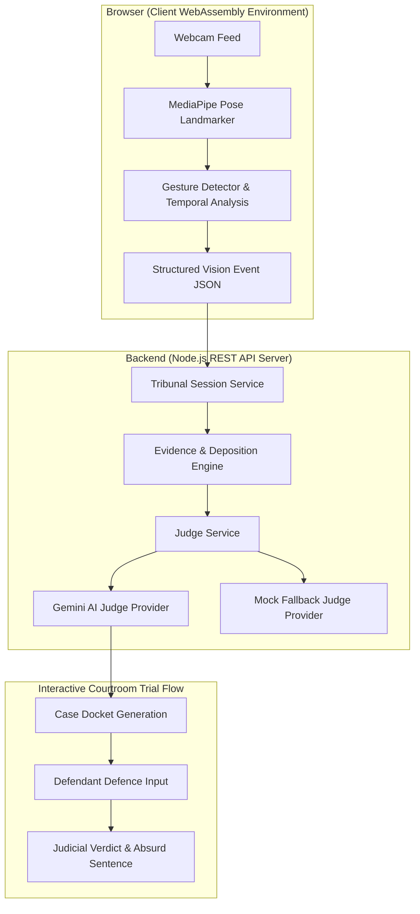

# HUMAN TRIBUNAL ⚖️

> **An intentionally absurd AI courtroom where everyday physical human behavior is put on trial.**

## Basic Details

### Team Name: Useless guys

### Team Members
- Team Lead: Aban Faruk - Ahalia School of Engineering and Technology
- Member 2: Haseeb - Ahalia School of Engineering and Technology
### Project Description
Human Tribunal is an absurd AI-powered courtroom experience that monitors physical human behavior in real-time using in-browser computer vision. When suspicious or unusual physical actions are observed—such as sitting completely motionless, raising a hand without judicial clearance, leaning dramatically, or fleeing the camera frame—the system generates structured evidence and initiates a high-stakes courtroom trial. Powered by Gemini, the AI Judge evaluates the evidence alongside the defendant's defense statement, delivering deadpan, Kerala courtroom-flavored verdicts and harmless, comical punishments.

### The Problem (that doesn't exist)
Every single day, millions of human beings perform deeply suspicious physical actions in front of their computers without any legal oversight. 

- Nobody investigates why someone suddenly crouched under their desk for 3 seconds.
- Nobody issues a subpoena when a user sits completely motionless staring into space.
- Nobody questions why someone fled the camera frame without requesting a court recess.
- Nobody holds individuals accountable for raising a hand without prior judicial clearance.

This total lack of judicial accountability in daily human movement is a non-existent crisis that threatens the fabric of domestic order.

### The Solution (that nobody asked for)
Human Tribunal solves this completely unnecessary problem by establishing an automated, real-time AI Courtroom:

1. **Browser-Based Surveillance**: Real-time pose tracking runs 100% locally in the browser via WebAssembly computer vision.
2. **Temporal Behavior Analysis**: Physical actions (stillness, crouching, hand gestures, frame departures) are tracked across time to filter out noise and generate verified courtroom evidence.
3. **Structured Case Generation**: Physical observations are structured into formal exhibits (`EXHIBIT A`, `EXHIBIT B`) without sending raw video frames anywhere.
4. **Gemini AI Judge**: Gemini processes the structured evidence, conducts a formal trial, analyzes defendant testimony, and issues authoritative judicial rulings with deadpan Manglish courtroom flavor.
5. **Absurd Sentences**: Defendants found guilty are assigned custom, harmless sentences (e.g., *"Sentenced to buy the court a chaya"* or *"Stand quietly and reflect on your posture for 30 seconds"*).

---

## Technical Details

### Technologies/Components Used

#### For Software:

- **Languages**:
  - TypeScript
  - JavaScript (ESNext)
  - HTML5 & CSS3

- **Frameworks**:
  - **React 19**: Modern component UI architecture
  - **Express.js (v4)**: Node.js REST API backend

- **Libraries**:
  - **`motion` (Framer Motion 12)**: Theatrical UI transitions and micro-animations
  - **`lucide-react`**: Courtroom & surveillance iconography
  - **`@tailwindcss/vite` (v4)**: Minimalist courtroom design system
  - **`cors` & `dotenv`**: HTTP middleware & environment configuration
  - **`tsx`**: TypeScript execution environment for Node.js

- **AI / ML**:
  - **Google GenAI SDK (`@google/genai`)**: Primary AI Judge integration using `gemini-3.5-flash` with fallback models (`gemini-3.5-flash-lite`, `gemini-3.7-flash`).
  - **Ollama Integration (Optional)**: Support for local LLM execution (`llama3.2`) via `LocalLLMJudgeProvider`.
  - **Deterministic Mock Judge**: Built-in zero-dependency fallback judge ensuring 100% uptime when offline.

- **Computer Vision**:
  - **`@mediapipe/tasks-vision`**: Google MediaPipe Pose Landmarker running local WebAssembly pose estimation in the browser at 30+ FPS.

- **Development Tools**:
  - **Vite 6**: Fast frontend bundler and development server
  - **TypeScript 5.8**: Full strict type safety across client and server

#### For Hardware:
- **No dedicated hardware required.**
- The project runs on any standard laptop or desktop equipped with a standard webcam.

---

### Conceptual Architecture & CV vs Gemini Distinction

It is critical to distinguish between the **Computer Vision layer** and the **Gemini Reasoning layer**:



#### 1. Computer Vision Layer (Browser WebAssembly)
- **Role**: Physical observation only.
- **Privacy & Execution**: Runs 100% locally inside the browser memory using MediaPipe Pose Landmarker WebAssembly. **No raw video frames, images, or biometric face data are ever uploaded or transmitted.**
- **Landmark & Temporal Analysis**: Analyzes 33 body keypoints (nose, shoulders, hips, wrists, ears) across time frames (`gestureDetector.ts`).
- **Temporal Tracking & Smoothing**: Requires pose persistence over specific duration thresholds (e.g., 4000ms for `STILLNESS`, 1500ms for `CROUCHING`, 800ms for `HAND_RAISED`) and applies a 3000ms cooldown to eliminate single-frame noise and duplicate triggers.
- **Implemented Physical Behaviors**:
  - `STILLNESS`: Sustained lack of nose/body displacement ($\text{dist} < 0.015$).
  - `RIGHT_HAND_RAISED` / `LEFT_HAND_RAISED` / `BOTH_HANDS_RAISED`: Wrist position elevated above shoulder line.
  - `HAND_ON_HEAD`: Wrist landmark within proximity threshold of ear/nose landmarks.
  - `LEANING`: Horizontal offset between shoulder midpoint and hip midpoint $> 0.15$.
  - `CROUCHING`: Torso height ratio $< 0.18$.
  - `SITTING` / `STANDING`: Vertical hip position tracking in camera viewport.
  - `SITTING_DOWN` / `STANDING_UP` / `CROUCHING_DOWN` / `RISING_FROM_CROUCH`: Posture transition tracking.
  - `MOVEMENT`: Active body coordinate displacement.
  - `LEFT_FRAME` / `RETURNED_TO_FRAME`: Landmark tracking loss and recovery.

#### 2. Gemini Layer (AI Judge & Narrative Engine)
- **Role**: Legal interpretation, case drafting, trial moderation, and verdict generation.
- **Zero-Shot Reasoning**: Gemini does **not** require a custom fine-tuned dataset. It receives clean, structured JSON evidence metadata emitted by the CV layer (e.g., `{ "gesture": "STILLNESS", "durationMs": 4200, "source": "CAMERA" }`).
- **Strict Evidence Grounding**: Gemini is strictly instructed via system prompts never to fabricate physical evidence or claim video access—it must base its reasoning exclusively on the provided camera metadata exhibits and defendant testimony.
- **Judicial Personality**: Acts as the Presiding Magistrate of the Human Tribunal—a dramatic, authoritative Indian/Kerala courtroom magistrate with deadpan dry humor, strict legal gravity, and subtle Manglish expressions (*"Athu kond"*, *"Scene is clear"*, *"Shari"*, *"Enthayalum"*).

---

### Implementation

#### Installation

1. **Clone the repository**:
   ```bash
   git clone https://github.com/your-username/useless.git
   cd useless
   ```

2. **Install Backend Dependencies**:
   ```bash
   cd backend
   npm install
   ```

3. **Install Frontend Dependencies**:
   ```bash
   cd ../frontend
   npm install
   ```

4. **Environment Configuration**:
   Create a `.env` file in the `backend/` directory (refer to `.env.example`):
   ```env
   PORT=3000
   VITE_API_URL="http://localhost:3000"
   
   # Optional: Configure Gemini API Key for online AI Judge evaluation
   GEMINI_API_KEY="your_google_gemini_api_key_here"
   
   # Optional: Local LLM runtime configuration
   JUDGE_PROVIDER="mock" # Set to "local" for Ollama or "gemini"
   OLLAMA_BASE_URL="http://localhost:11434"
   OLLAMA_MODEL="llama3.2"
   ```
   > **Note**: Do not commit secret `.env` API keys to version control.

#### Run

1. **Start the Backend REST API Server**:
   ```bash
   cd backend
   npm run dev
   ```
   *Backend runs at `http://localhost:3000`*

2. **Start the Frontend Application (in a separate terminal)**:
   ```bash
   cd frontend
   npm run dev
   ```
   *Frontend runs at `http://localhost:5173`*

3. **Competition Demo Mode**:
   For presentation and judging convenience, launch the one-shot fail-safe presentation flow:
   👉 **`http://localhost:5173/?demo=true`**

---

### Project Documentation

#### For Software:

# Screenshots (Add at least 3)

### Screenshots to Add


*Figure 1: The real-time Computer Vision Surveillance interface showing live MediaPipe pose landmark tracking, temporal behavior state indicators, and active exhibit recording.*


*Figure 2: The interactive Courtroom Trial screen where the defendant reviews formal charges, inspects submitted exhibits, and enters their defense testimony.*


*Figure 3: The Final Verdict interface rendering the AI Judge's ruling, confidence rating, evidence breakdown, and comical absurd sentence.*

# Diagrams


*Figure 4: End-to-end dataflow architecture from local WebAssembly posture observation to backend tribunal state storage and Gemini AI Judge evaluation.*

#### For Hardware:

# Schematic & Circuit

*No custom hardware circuit required. Uses standard USB/built-in webcam.*


*Standard computer camera interface via WebRTC / HTML5 MediaDevices API.*

# Build Photos

*System operates on standard personal computer hardware with camera.*


*Software build process handled via Vite and npm packages.*


*Final deployed software interface running in web browser.*

---

### Project Demo

# Video
[ADD DEMO VIDEO LINK HERE]
*The demo video demonstrates real-time camera behavior detection, automatic courtroom case creation upon prolonged stillness or hand gestures, submitting a defense statement, and receiving a deadpan verdict from the Gemini AI Judge.*

# Additional Demos
- **Competition Presentation Guide**: See [competition-presentation.md](file:///e:/development/useless/docs/competition-presentation.md)
- **Technical Architecture Spec**: See [architecture.md](file:///e:/development/useless/docs/architecture.md)

---

## Team Contributions

- [ADD TEAM MEMBER 1]: [Specific contributions - e.g., Frontend UX, Courtroom Components & Animation]
- [ADD TEAM MEMBER 2]: [Specific contributions - e.g., MediaPipe Pose Vision Pipeline & Temporal Detector]
- [ADD TEAM MEMBER 3]: [Specific contributions - e.g., Express Backend, Gemini AI Judge Provider & Session Engine]

---

Made with ❤️ at TinkerHub Useless Projects 


